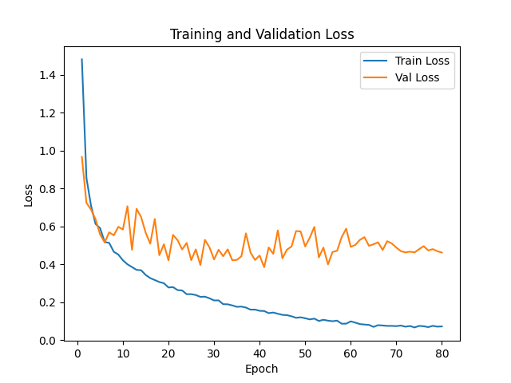

# NYCU Computer Vision 2025 Spring HW1

**StudentID:** 313551044\
**Name:** 曾偉杰

## Introduction

This project is the HW1 of the **NYCU Computer Vision 2025 Spring** course. The assignment focuses on training an image classification model using **ResNeXt** or other **ResNet-based CNNs** as the backbone.

- **Dataset Details:**
  - **Training / Validation:** 21,024 images
  - **Test Set:** 2,344 images
  - **Number of Classes:** 100

## Table of Contents
- [Introduction](#introduction)
- [How to Install](#how-to-install)
- [Performance Snapshot](#performance-snapshot)
- [Usage](#usage)

## How to Install
Follow these steps to set up the environment and install dependencies:

1. Clone the repository:
   ```sh
   git clone https://github.com/Willy0921/NYCU-CV_ML-2025.git
   cd hw1
   ```
2. Create environment:
    ```sh
    conda create -n cv_ml_hw1 python=3.12 -y
    conda activate cv_ml_hw1
    ```
3. Install PyTorch with CUDA support
   ```bash
   pip3 install torch torchvision torchaudio
   ```
4. Install additional dependencies
   ```bash
   pip install timm pillow tqdm matplotlib
   ```
## Performance Snapshot
### Main Result
#### Using Backbones with Different Architecture
| Model Variant   | Top-1 Acc(%) | # parameters   |
| :-: | :-: | :-: |
| ResNeXt26 + 3-layer MLP  | 90.33  |  33.6M |
| ResNeXt50 + 3-layer MLP  | 92.00  | 48.3M  |
| ResNeXt101 + 2-layer MLP | 91.67  | 99.5M  |
| **SEResNeXt50 + 3-layer MLP** | **92.33**  | 50.9M  |
#### Training Curve of SEResNeXt50 Backbone
<p>
  
  
</p>

### Additional Experiments
#### Different Augmentation Strategies (all with ResNeXt50)
| Augmentation Variant   | Top-1 Acc(%) |
| :-: | :-: |
| No augmentation  | 92.00  | 
| AugMix  | 91.67  | 
| RandAug | 92.00  |
| Custom augmentation | 92.00  |
#### Different Input Resolution (all with ResNeXt50)
| Input Size Variant   | Top-1 Acc(%) | 
| :-: | :-: | 
| 224 x 224  | 86.67  |
| 336 x 336  | 89.67  |
| **512 x 512** | **92.00**  | 
## Usage
Put the dataset into ```./data```
### Training
   ```python
   python train.py --data_dir ./data --epochs [NUMBER_OF_EPOCHS] --batch_size [BATCH_SIZE]
   ```
   After training, the checkpoint will save at ```./exp/XXXXXXXX/```
### Inference
   ```python
   python inference.py --model_path [PATH_TO_YOUR_CHECKPOINT] --image_folder [PATH_TO_TEST_IMAGE_FOLDER] --class_labels ./idx_to_class.json 
   ```
   The prediction results will appear at ```./prediction.csv```