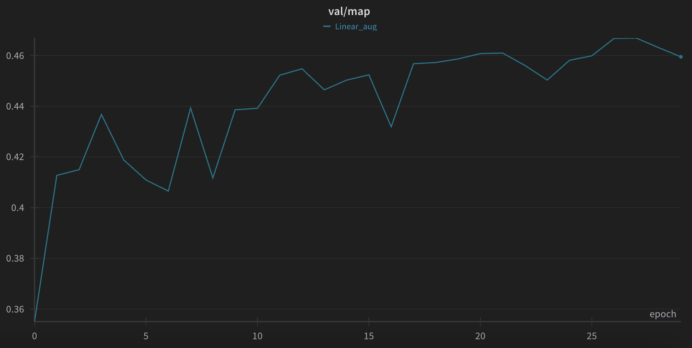
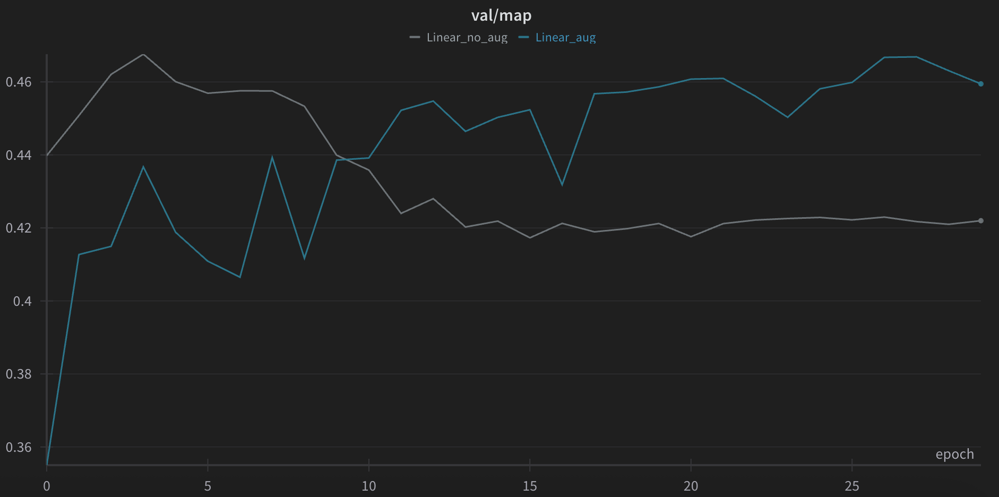
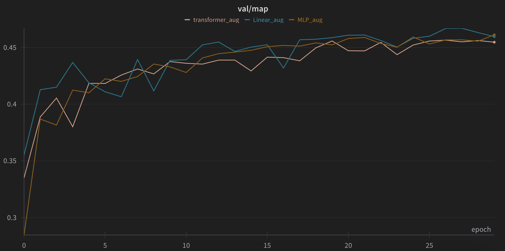

# NYCU Computer Vision 2025 Spring HW2 - Object Detection

**StudentID:** 313551044\
**Name:** 曾偉杰

## Introduction

This project is the HW2 of the **NYCU Computer Vision 2025 Spring** course. This assignment focuses on detecting individual digits within RGB images containing house numbers or similar numerical sequences. The dataset provided for this task is split into:
- **Dataset Details:**
    - Training Set: 30,062 images
    - Validation Set: 3,340 images
    - Test Set: 13,068 images

## Table of Contents
- [Introduction](#introduction)
- [How to Install](#how-to-install)
- [Performance Snapshot](#performance-snapshot)
- [Usage](#usage)

## How to Install
Follow these steps to set up the environment and install dependencies:

1. Clone the repository:
   ```sh
   git clone https://github.com/Willy0921/NYCU-CV_ML-2025.git
   cd hw2
   ```
2. Create environment:
    ```sh
    conda create -n cv_ml_hw1 python=3.12 -y
    conda activate cv_ml_hw1
    ```
3. Install PyTorch with CUDA support
   ```bash
   pip3 install torch torchvision torchaudio
   ```
4. Install additional dependencies
   ```bash
   pip install -r requirements.txt
   ```
## Performance Snapshot
### Main Result
#### Using Backbones with Different Architecture
| Model Variant   | mAP (on val set) | Acc (on public test set) |
| :-: | :-: | :-: |
| **ResNet50 Backbone w/ Augmentation** | **0.467** | **0.83** |
#### Training Curve
<p>
  
  
</p>

### Additional Experiments
#### The Effect of Augmentation
| Augmentation Variant (Linear)   | mAP (on val set) | Acc (on public test set) |
| :-: | :-: | :-: |
| No Augmentation | 0.467 | 0.78 |
| Simple Augmentation | 0.467 | **0.83** |
<p>
  
</p>

#### Different Head Variant
| Model Variant   | mAP (on val set) | Acc (on public test set) |
| :-: | :-: | :-: |
| **1-Layer Linear Projection** | **0.467** | **0.83** |
| 3-Layer MLP | 0.461 | 0.77 |
| CLS & BBox Tokens Cross Attention | 0.456 | 0.80 |
<p>
  
</p>

## Usage
Put the dataset directory under ```./data```
### Setup configs
The config files are located in ```configs/```. You can modify the hyperparameters and other settings in the config files.
### Training
   ```sh
   python train.py
   ```
   If you use wandb, the saved checkpoints will be stored in the `./[YOUR WANDB PROJECT NAME]/` directory.
   If not, the saved checkpoints will be stored in the `./lightning_logs/` directory.
### Inference
   ```sh
   python predict.py
   ```
   The inference results will be saved in the `./outputs/XXXX-XX-XX/` directory. Which includes `pred.json` and `pred.csv`.