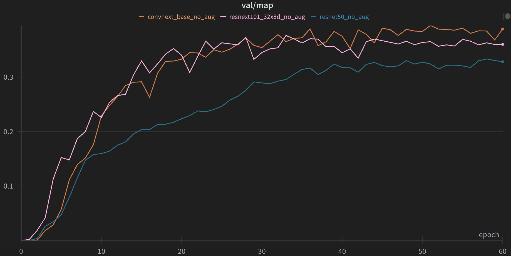

# NYCU Computer Vision 2025 Spring HW3 - Instance Segmentation

**StudentID:** 313551044
**Name:** 曾偉杰

## Introduction

This project is the HW3 of the **NYCU Computer Vision 2025 Spring** course. This assignment focuses on instance segmentation on colored medical images, aiming to identify and segment four distinct cell types. The dataset provided for this task is split into:

* **Training/Validation Set:** 209 images
* **Test Set:** 101 images

## Table of Contents

* [Introduction](#introduction)
* [How to Install](#how-to-install)
* [Performance Snapshot](#performance-snapshot)
* [Usage](#usage)

## How to Install

Follow these steps to set up the environment and install dependencies:

1. Clone the repository:

   ```sh
   git clone https://github.com/Willy0921/NYCU-CV_ML-2025.git
   cd hw3
   ```
2. Create environment:

   ```sh
   conda create -n cv_ml_hw3 python=3.12 -y
   conda activate cv_ml_hw3
   ```
3. Install PyTorch with CUDA support

   ```bash
   pip3 install torch torchvision torchaudio
   ```
4. Install additional dependencies

   ```bash
   pip install -r requirements.txt
   ```

## Performance Snapshot

### Main Result

|                   Model Variant                   | mAP (val) | mAP (public test set) |
| :-----------------------------------------------: | :-------: | :-------------------: |
| **ConvNeXt-Base Backbone + Custom Augmentations** |  **0.39** |        **0.31**       |

#### Training Curve

<p>
  
  
</p>

### Additional Experiments

#### Impact of Patching

|      Variant     | mAP (val) | mAP (public test set) |
| :--------------: | :-------: | :-------------------: |
| Without Patching |    0.21   |          0.17         |
| 512×512 Patching |    0.33   |          0.27         |

#### Different Backbone

|  Backbone Variant | mAP (val) | mAP (public test set) |
| :---------------: | :-------: | :-------------------: |
|     ResNet-50     |    0.33   |          0.26         |
| ResNeXt-101 32×8d |    0.37   |          0.28         |
| **ConvNeXt-Base** |  **0.39** |        **0.31**       |

<p>
  
</p>

#### Effect of Augmentation

| Augmentation Variant | mAP (val) | mAP (public test set) |
| :------------------: | :-------: | :-------------------: |
|    No Augmentation   |    0.39   |          0.30         |
| Custom Augmentations |    0.39   |          0.31         |

<p>
  
</p>

## Usage

Put the dataset directory under `./data`

### Setup configs

The config files are located in `configs/`. You can modify hyperparameters and other settings there.

### Training

```sh
python train.py
```

If you use wandb, checkpoints will be stored in `./[YOUR_WANDB_PROJECT_NAME]/`. Otherwise, they'll be in `./lightning_logs/`.

### Inference

```sh
python predict.py --ckpt [YOUR_CHECKPOINT_PATH]
```

Results will be saved in the same folder with`./YOUR_CHECKPOINT_PATH/`, which is `test-results.json`.
