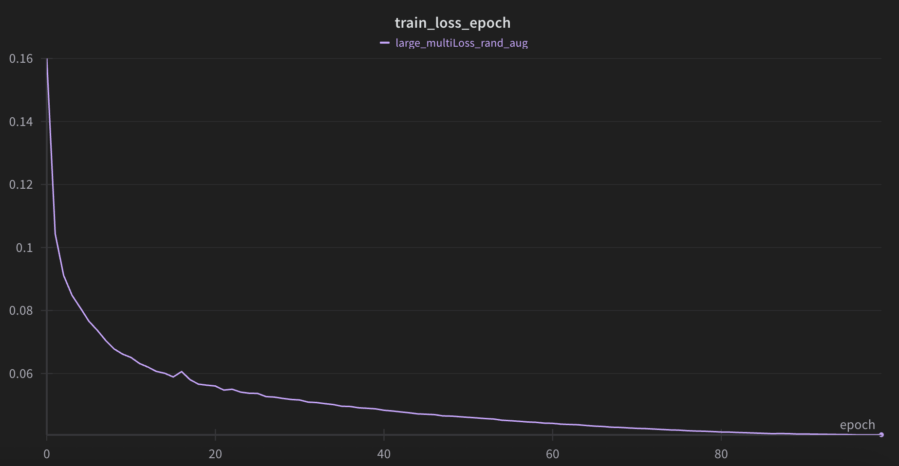
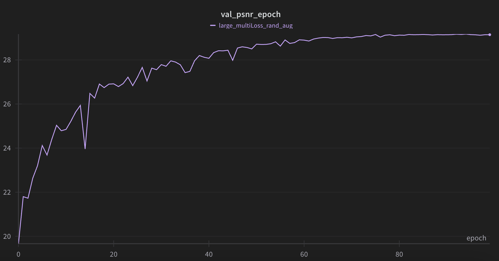
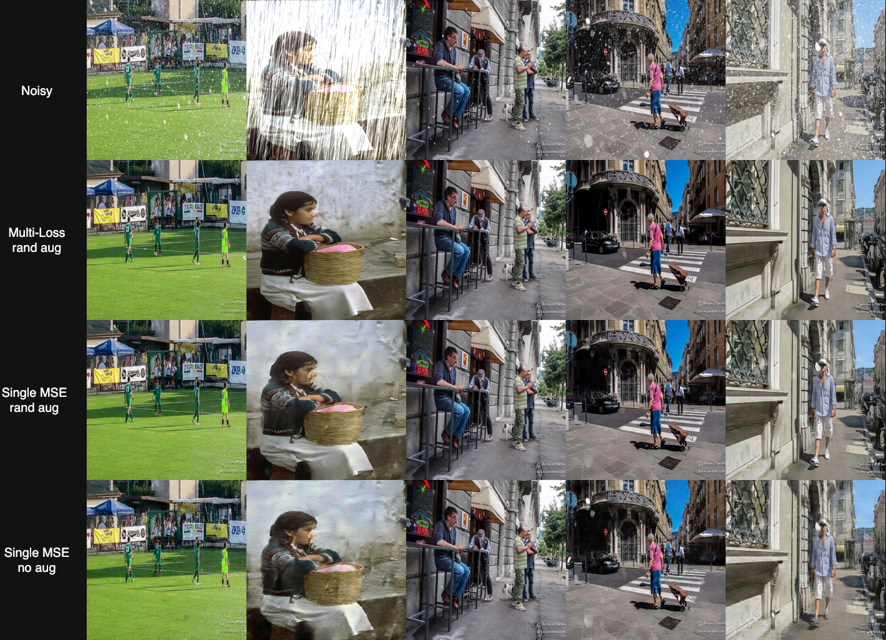

Okay, here's a draft for your HW4 README, following the style of your HW3 README and using the information from your HW4 report:

---

# NYCU Computer Vision 2025 Spring HW4 - Image Restoration

**StudentID:** 313551044
**Name:** 曾偉杰
**Github page:** [https://github.com/Willy0921/NYCU-CV_ML-2025/tree/main/hw4](https://github.com/Willy0921/NYCU-CV_ML-2025/tree/main/hw4)

## Introduction

This project is the HW4 of the **NYCU Computer Vision 2025 Spring** course. This assignment tackles **image restoration**, focusing on the removal of two specific types of degradation from images: **rain streaks** and **snow noise**. Given an input image corrupted by either of these weather-induced noises, the objective is to reconstruct a clean, high-quality version of the image.

The dataset for this task is structured as follows:
*   **Training/Validation Set:** A total of 3200 unique degraded/clean image pairs.
    *   1600 degraded images with rain effects and their 1600 corresponding clean images.
    *   1600 degraded images with snow effects and their 1600 corresponding clean images.
    *   (Randomly split into 90% for training and 10% for validation at the image level).
*   **Test Set:** A total of 100 degraded images for leaderboard evaluation.
    *   50 degraded images featuring rain.
    *   50 degraded images featuring snow.

## Table of Contents

* [Introduction](#introduction)
* [How to Install](#how-to-install)
* [Performance Snapshot](#performance-snapshot)
* [Usage](#usage)
* [Visualization Examples](#visualization-examples)

## How to Install

Follow these steps to set up the environment and install dependencies:

1.  Clone the repository:
    ```sh
    git clone https://github.com/Willy0921/NYCU-CV_ML-2025.git
    cd NYCU-CV_ML-2025/hw4 
    ```
2.  Create environment (you can adjust the Python version if needed):
    ```sh
    conda create -n cv_ml_hw4 python=3.10 -y 
    conda activate cv_ml_hw4
    ```
3.  Install PyTorch with CUDA support (adjust based on your CUDA version):
    ```bash
    pip3 install torch torchvision torchaudio 
    ```
4.  Install additional dependencies:
    ```bash
    pip install -r requirements.txt
    ```

## Performance Snapshot

### Main Result

The best performing model is **Large-multiLoss PromptIR** with **Random Augmentation**.

| Model Variant                                           | *PSNR (val) | *PSNR (public test set) |
| :------------------------------------------------------ | :---------: | :---------------------: |
| **Large-multiLoss PromptIR (random augmentation)** |  **29.17**  |        **30.61**        |


#### Training Curve (Main Model)

<p>
  
  
</p>

### Additional Experiments

#### Different Losses


| Variants         | *PSNR (val) | *PSNR (public) |
| :--------------- | :---------: | :------------: |
| **Multi-loss**   |  **29.17**  |   **30.61**    |
| Single MAE loss  |    26.34    |     27.84      |

#### The Effect of Augmentation

| Variants              | *PSNR (val) | *PSNR (public) |
| :-------------------- | :---------: | :------------: |
| No augmentation       |    24.62|26.06|
| **Random augmentations** |  **26.34**|	**27.84**     |


## Usage

1.  **Dataset:**
    Place the dataset directory (e.g., `RainSnow_Dataset/`) under the `./data/` folder.

2.  **Setup configs:**
    The configuration files are located in the `configs/` directory.

3.  **Training:**
    To start training the model:
    ```sh
    python train.py
    ```
    If you use Weights & Biases (wandb), checkpoints and logs will be stored according to your wandb setup (e.g., `./[YOUR_WANDB_PROJECT_NAME]/`). Otherwise, they'll typically be in `./lightning_logs/`.

4.  **Inference / Prediction:**
    To run inference on the test set using a trained checkpoint:
    Set `$CKPT_DIR` and `$ZIP_NAME` in `predict.sh` to your checkpoint directory and desired output zip file name, respectively. Then run:
    ```sh
    sh predict.sh
    ```
    The result `$ZIP_NAME.zip`will be saved in the `results/` directory.

## Visualization Examples

<p align="center">
  
</p>

---